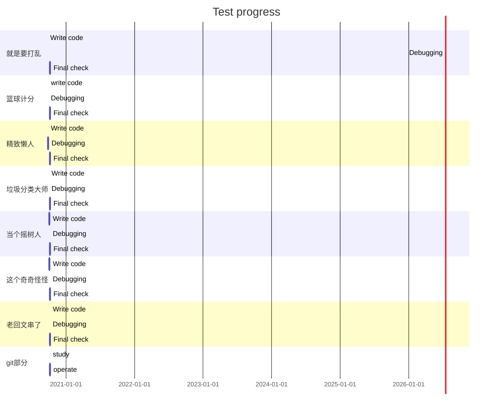

# ANZ joint lab test

## Personal information

| Name       | Student ID        |
| ---------- | ----------------- |
| **杨家琪** | **2020090904022** |

## Test progress

> *Show your progress below.*



> 
>
> *Or write it directly:*
> ***FINISHED:***
> ...
> ...


---
## Answer sheet

> *Write your answer below. (if asked)*

***1.就是要打乱:***

#### 代码：

````c
#include<stdio.h>
#include<ctype.h>
#include<string.h>
int main(){
	int a[100],m=0,i=0;
	char str[100],n;
	printf("please input the string(within 100 characters): ");
	scanf("%s",&str);
	getchar();
	printf("please input the numbers(numbers are separeted with ','):");
	while((n=getchar())!='\n'){
		if(isdigit(n)){
			ungetc(n,stdin);
			scanf("%d",&a[m++]);
		}
	
	}
	int len=strlen(str);
	if(m!=len){
		printf("the length of the string and the array are not equal!");
		return -1;
	}
	for(;i<m;i++)printf("%c",str[a[i]]);
	return 0；
}

````

***学到的知识点：***

- 数组可以嵌套
- getchar会把前一个printf最后输入的回车键入，所以要在它们之间再输入一个getchar抵消回车！
- 用ctype.h库函数将输入中的“，”去掉，仅剩下数字在识别。

***2.篮球计分:***

#### 代码：

```c
#include<stdlib.h>
#include<stdio.h> 
typedef struct List{
    int *listadd;
    int length;
    int length_max;
}list;
list *creatlist(int  n);
int insert(list *sqlist,int pos,int points);
int c_mod(list *sqlist,int pos);
int d_mod(list*sqlist,int pos);
int add_mod(list*sqlist,int pos);
int main(){
    int maxlength=1000,n=0,sum=0,x;
    char input[1000],c;
    list *sqlist=creatlist(maxlength);
    printf("please input the signs(input one by one):");
	scanf("%c",&c);
	while(c!='\n'){
		input[n]=c;
		n++;
		scanf("%c",&c);
	}
    for(int i=0;i<n;i++){
        if(input[i]=='C')c_mod(sqlist,i);
        if(input[i]=='D')d_mod(sqlist,i);
        if(input[i]=='+')add_mod(sqlist,i);
        else {
        	x=("%d",input[i])-48;
			insert(sqlist,i,x);
			}
    }
    for(;n>=0;n--)sum+=sqlist->listadd[n];
    printf("%d\n",sum);
    return 0;
}
list *creatlist(int n){
    list *sqlist=(list*)malloc(sizeof(list));
    if(sqlist!=NULL){
        sqlist->listadd=(int*)malloc(sizeof(int)*n);
        sqlist->length=0;
        sqlist->length_max=1000;
        }
    return sqlist;
}
int insert(list*sqlist,int pos,int points){
    if(sqlist->length==sqlist->length_max)return -1;
    sqlist->listadd[pos]=points;
    return ++sqlist->length;
}
int c_mod(list *sqlist,int pos){
    for(;pos>=0;pos--){
        sqlist->listadd[pos]=sqlist->listadd[pos+1];}
    return --sqlist->length;
}    
int d_mod(list*sqlist,int pos){
    if(sqlist->length==sqlist->length_max||pos<1)return -1;
    sqlist->listadd[pos]=sqlist->listadd[pos-1]*2;
    return ++sqlist->length;
}
int add_mod(list*sqlist,int pos){
    if(sqlist->length==sqlist->length_max||pos<2)return -1;
    sqlist->listadd[pos]=sqlist->listadd[pos-1]+sqlist->listadd[pos-2];
    return ++sqlist->length;
}


```

***学到的知识点：***

- 当要有多个程序对同一组数据操作时，选择线性表，栈或者队列十分有效！


***3.精致懒人：***


### 对题目的一点看法：

根据提示，可以把问题简化为所有数除于2之后余数是1还是0的问题。因为任意移动两格代价总是0，所以代价最小的位置其实只有三种情况，***即全体奇数或偶数或放哪里都行***，想要专门找一个代价最小的点是不可能的，所以我在编程序时仅按照以上三种情况输出。


#### 代码：

```c
#include <stdio.h>
#include<ctype.h>
int main(){
	int a[100],i=0,times0=0,times1=0,n=0;
	char c;
	printf("location(within 100 numbers)=");
    while((c=getchar())!='\n'){
		if(isdigit(c)){
			ungetc(c,stdin);
			scanf("%d",&a[n++]);
		}
	}
	for(;i<n;i++){
		if(a[i]%2==0)times0++;
		else if(a[i]%2==1)times1++;
	}
	if(times0<times1)printf("Minimum cost:%d,Put in odd numbers",times0);
    else if(times0>times1) printf("Minimum cost:%d,Put in even numbers",times1);
    else if(times0==times1)printf("Minimum cost:%d,put in anywhere",times1);       
    return 0;
}

```


***学到的知识点：***

- 思路很重要！！！可以简化掉很多过程！
- 把具体的过程抽象化


***4.这个奇奇怪怪的***

#### 代码：

```c
#include<stdio.h>
#include<ctype.h>
int main(){
	int a[10],i=0,n=0;
	char c;
	printf("please input the array(use ',' to separate the numbers):");
	while((c=getchar())!='\n'){
		if(isdigit(c)){
			ungetc(c,stdin);
			scanf("%d",&a[n++]);
		}
	
	}
	for(;i<n;i++){
		if(a[i]==i){
			printf("output:%d\n",i);
			return 0;
		}
	}
	return -1;
}

```


***5.老回文串了***

#### 代码：

```c
#include<stdio.h>
#include<ctype.h>
#include<string.h>
int main(){
	int n=0,h=0,a1=0;
	char c,a[100];
    printf("please input the string:");
	//先把输入转化为可以识别的形式 
	while((c=getchar())!='\n'){
		if(isdigit(c)||islower(c)||isupper(c)){
			ungetc(c,stdin);
			scanf("%c",&a[n++]);//这里n就是字符个数
		}
	
	}
	strlwr(a);//大写转为小写
	if(n%2==1){
		h=n/2;
		for(;a1<=h;a1++){
			if(*(a+a1)!=*(a+n-1)){
				printf("false");
				return 0;
			}
			n--;
		}
	}
	if(n%2==0){
		h=n/2;
		for(;a1<=h;a1++){
			if(*(a+a1)!=*(a+n-1)){
				printf("false");
				return 0;
			}
			n--;
		}
	}
	printf("true");
	return 0;
}

```


#### 学到的知识点：

- ctype库函数的应用

- 刚开始比较回文串前后时用的是数组，结果代码写得老长了，还光错。后来改成指针既简短又一遍成！


***6.垃圾分类大师***

#### 代码：

```c
#include<stdio.h>
#include<ctype.h>
int main(){
	int a[10],i=0,n=0,t1=0,t2=0,t3=0;
	char c;
	while((c=getchar())!='\n'){
		if(isdigit(c)){
			ungetc(c,stdin);
			scanf("%d",&a[n++]);
		}
	
	}
	for(int m=0;m<n;m++){
		if(a[m]==1)t1++;
		else if(a[m]==2)t2++;
		else if(a[m]==3)t3++;
		else printf("%d position is an unrecognized type of garabage!\n",m);
	}
	for(int x1=0;x1<t1;x1++)printf("1,");
	for(int x2=0;x2<t2;x2++)printf("2,");
	for(int x3=0;x3<t3-1;x3++)printf("3,");
	printf("3\n");
	return 0;
}

```

***思路：***

- 先将输入储存到数组

- 然后分类统计1，2，3出现的次数
- 最后按次数输出即可


***7.当个摇树人***

#### 代码：

```c
#include<stdio.h>
#include<string.h>
int find_bp(char*a,char*b,int p,int l);
int main(){
	int pa[50],pb[50],la,lb,p=0,pa0;
	char a[50],b[50],ja,jb;
	printf("please input string 'a' and 'b'(separated by 'enter'):\n");
	scanf("%s%s",&a,&b);
	la=strlen(a);
	lb=strlen(b);
	if(la==lb){
		for(int i=0;i<=la;i++){//先把所有交换位置的字符的下表都找出来！ 
			if(a[i]!=b[i]){
				pa[p]=i;
				p++;//最后p多加了一,后面都要小心去掉 
			}
		}
		pa0=pa[0];
		int m=find_bp(a,b,pa0,la); 
		//再判断哪几个交换了！p记录有几个交换了，m将向前移动和向右移动区分开！而数组pa里面则记录所有交换了的字符的下标 
		for(int x=0;x<=(pa[p-1]-m+1);x++){//此时m-pa[0]记录了左移个数，pa[p-1]-m+1记录了右移个数！此时用for语句判断即可！ 
			if(a[pa[0]+x]==b[m+x])ja='t';
		}
		for(int y=0;y<=m-pa[0];y++){
			if(a[pa[p-1]-y]==b[m-1-y])jb='t';
		}
		if(ja=='t'&&jb=='t')printf("\ntrue");
		else printf("\nfalse");
	}
	
	else printf("your input is illegal!");
	return 0;
}
//因为变量在for中定义时作用域只在for内，所以可以用函数解决。但用全局变量简单多了，回过头看时才发现..... 
int find_bp(char*a,char*b,int p,int l){
		for(int m=0;m<=l;m++){
			if(*(a+p)==*(b+m))return m;
		} 
		
}

```

***思路：***

- 找出规律:先找出所有交换位置的字母，并区分左移还是右移，向右移的字母的数量就等于向左移的字母的移动距离，对比一下即可。
- 本来的思路想把字符串每次分出去1个，然后一一比较，但这样不行，因为还有可能是多个与多个的交换！


## git题目

- 版本管理即当多人编辑同一个大型程序时，为了支持很多人在任何时候，任何地方都可以编辑，而且随时可以获取最新版本的程序。就在一个特定的系统上保存程序文件的修改记录（包括日期，编辑者和改动的地方等等）和历史版本，以便日后查看和使用。这个系统的文档库可以随时与你的本地文档库交换数据。而且git支持分布式方法，即每个人都可以随时获取任何程序文件修改，等送回系统时再根据需要进行合并。此外，通过github还可以向世界发布自己的程序，也可以看其他人的程序，这种开源模式促进了软件行业的飞速发展。
- 把远程文档复制到本地文档库后，使用*git cheekout -b '分支名' commit '节点标识符或标签'*来创建并转入新的分支，编辑完成后，用指令*git push origin '分支名'* 把本地文档库做的修改送到远程文档库中。
- 1.在项目文件夹中删除要撤回的文件

​       2.打开Git Bash,执行 *git add - A.*

​       3.执行 *git status*指令，刚刚被删除的文件就会被标记出来

​       4.执行 *git commit* 从新的commit节点删除这个文件

- 当两个或多个分支修改了代码的相同位置，但修改内容不同时，会造成代码冲突。在gitbash界面会用Merge conflict显示冲突的文件，在文件里用

  '<<<<<<<<'

  '========'

  '>>>>>>>>'

  包起来的地方就是了。找到冲突的地方改正就好了。

  另外还可以用文件对比程序KDiff3等能更方便得找出不同